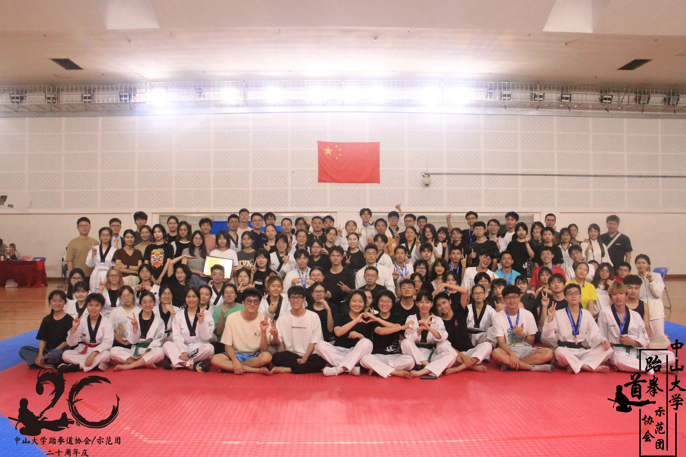

# SYSUTKD-2024招新！体验课！

零基础的你无需胆怯！

有潜力的你无需怀疑！

白带小白逆袭的黑带大佬的传说说的就是你！

专业教练指导，光速升级，每年多次考带，拿不完的体育章……

还在犹豫什么，赶紧加入我们吧！

想提前感受跆协训练和氛围的小伙伴，**体验课**等你来哦。

## 进来后有什么?

每周日常训练！助你夯实基础！

练后一定团建！壮大吃饭团队伍!

在拿下品势/竞技/特技的基础章节后

可根据个人喜好进行专项升级！！

**校队将面向全体社团成员开展选拔赛！通过者将代表SYSU参加省级/国家级比赛！**

日常训练/带训练/参赛/参与组织跆拳道专题的定向越野等均可获得体育章！

校级社团干部，省级/国际级比赛获奖的加分证书等你来拿！！

## 南校体验课

☺️☺️☺️ 体验课由阿教（郭忠民老师）来带训！会根据零基础/有基础分开进行～

⭕️时间：周六下午（9月21号）2:30～5:00（分两场/每场50分左右）

❗️第一场2:30～3:30 

❗️第二场4:00～5:00

⭕️地点：南校园新体M104 

## 东校体验课

**东校** 9月22号晚19:30-21:30

**地点**：东校园体育馆负一楼

## 北校体验课

**北校** 9月27号晚19:30-21:30

**地点**：北校新体育馆一楼

## 深圳体验课

**深圳** 9月20日晚19∶30-21∶30

**地点**：新体育馆负一层跆拳道室

## 珠海体验课

**珠海** 9月28日晚19:30-21:30

**地点**：新体二楼跆拳道教室
