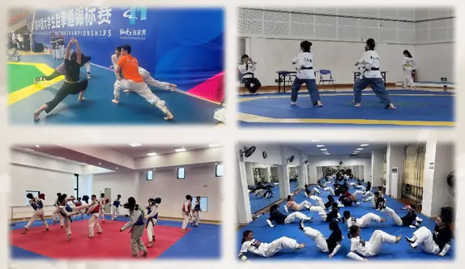

# SYSUTKD-2024招新！体验课！

----

### **[各校区体验课具体时间地点](./sysu35/tyk.md)**

----

零基础的你无需胆怯！

有潜力的你无需怀疑！

白带小白逆袭的黑带大佬的传说说的就是你！

专业教练指导，光速升级，每年多次考带，拿不完的体育章……

还在犹豫什么，赶紧加入我们吧！

想提前感受跆协训练和氛围的小伙伴，**体验课**等你来哦。

## **进来后能学什么?**

将会根据协会专门制定的零基础培养计划进行教学

同时兼顾零基础/有基础成员的训练，不必担心学不到东西~

每周日常训练！助你夯实基础！

练后一定团建！壮大吃饭团队伍!

在拿下品势/竞技/特技的基础章节后

可根据个人喜好进行专项升级！！

穿插教学最新版的比赛规则，裁判口令

日常训练/带训练/参赛/参与组织跆拳道专题的定向越野等均可获得体育章！

校级社团干部，省级/国际级比赛获奖的加分证书等你来拿！！

----

### **级位/段位晋升**

教学内容涵盖考带内容。

每学期均有考带机会，自愿报名。

每学年暑期末会进行考段集训，最高可考四段。

----

### **进入校队的方式**

**校队将面向全体社团成员开展选拔赛！通过者将代表SYSU参加省级/国家级比赛！**

队内硕博士云集，能了解到的何止跆拳道~

